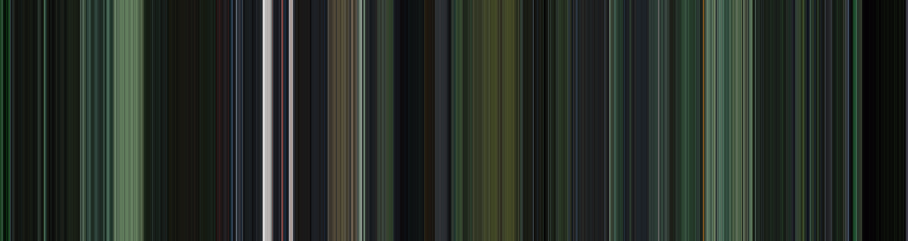
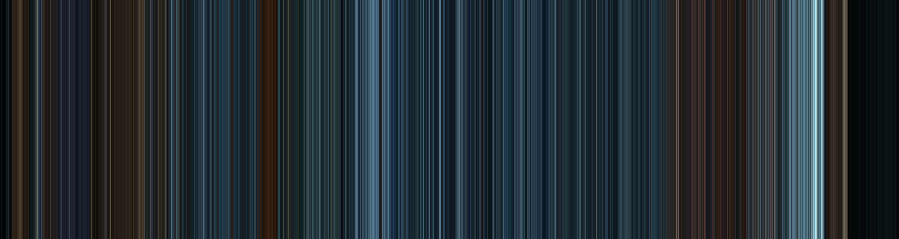

# Chroma-Vue

**Transform any video into a stunning color timeline in seconds**

A fast video color timeline generator that extracts the average color from each frame and creates a beautiful visual timeline.

## Examples

|  |  |  |
|:---:|:---:|:---:|
| **Blade Runner 2049** | **Cars** | **Fight Club** |

|  |  |  |
|:---:|:---:|:---:|
| **John Wick Chapter 2** | **Mad Max: Fury Road** | **Midsommar** |

|  |  |  |
|:---:|:---:|:---:|
| **Spider-Man: Into the Spider-Verse** | **The Grand Budapest Hotel** | **The Matrix** |

|  |  |  |
|:---:|:---:|:---:|
| **Tron: Legacy** | **La La Land** | **Nightcrawler** |

## Quick Start

**Input:** Any video file (MP4, MKV, AVI, etc.)  
**Output:** Color timeline image

**Command:**
```bash
docker run --rm -v $(pwd):/videos shmdtt/chroma-vue your_video.mp4
```

**Custom dimensions:**
```bash
docker run --rm -v $(pwd):/videos shmdtt/chroma-vue your_video.mp4 --width 4000 --height 1000
```

## Features

- **Fast**: Multiprocessed for maximum performance
- **Simple**: One command, no dependencies
- **Flexible**: Customizable output dimensions
- **Cross-platform**: Works everywhere with Docker

## How It Works

1. Extract frames from your video
2. Calculate average color for each frame
3. Generate timeline by arranging colors chronologically
4. Save as PNG image

## Command Options

- `--width`: Image width in pixels (default: 3000)
- `--height`: Image height in pixels (default: 800)
- `--workers`: Number of worker processes (default: CPU count)

## Platform Examples

**Linux/macOS:**
```bash
docker run --rm -v $(pwd):/videos shmdtt/chroma-vue video.mp4
```

**Windows Command Prompt:**
```cmd
docker run --rm -v %cd%:/videos shmdtt/chroma-vue video.mp4
```

**Windows PowerShell:**
```powershell
docker run --rm -v ${PWD}:/videos shmdtt/chroma-vue video.mp4
```

## Local Installation

If you prefer not to use Docker, you can run Chroma-Vue locally with Python.

### Prerequisites

- **Python 3.6+** installed on your system
- **FFmpeg** installed and accessible from command line
- **Git** (optional, for cloning the repository)

### Installing FFmpeg

**Windows:**
```bash
# Using chocolatey
choco install ffmpeg

# Or download from https://ffmpeg.org/download.html
```

**macOS:**
```bash
brew install ffmpeg
```

**Linux (Ubuntu/Debian):**
```bash
sudo apt update
sudo apt install ffmpeg
```

### Setup Steps

1. **Clone or download** this repository:
```bash
git clone https://github.com/yourusername/chroma-vue.git
cd chroma-vue
```

2. **Create a virtual environment** (recommended):
```bash
# Create virtual environment
python -m venv venv

# Activate virtual environment
# On Windows:
venv\Scripts\activate
# On macOS/Linux:
source venv/bin/activate
```

3. **Install Python dependencies**:
```bash
pip install -r requirements.txt
```

4. **Verify FFmpeg installation**:
```bash
ffmpeg -version
```

### Usage

**Basic usage:**
```bash
python chroma-vue.py your_video.mp4
```

**With custom options:**
```bash
python chroma-vue.py your_video.mp4 --width 4000 --height 1000 --workers 8
```

### Troubleshooting

- **"ffmpeg not found"**: Ensure FFmpeg is installed and in your system PATH
- **"Out of memory"**: Reduce the number of workers or ensure sufficient RAM
- **Slow processing**: Try adjusting worker count or check storage performance

## Performance Benchmarks

Tests performed on WSL2 with the following specifications:
- **CPU**: Intel Core i7-1065G7 @ 1.30GHz (8 logical cores)
- **RAM**: 16GB total, 8068MB allocated to WSL2
- **Workers**: 8 processes
- **Swap**: 2048MB

| Resolution | File Size | File Duration | FPS | Total Frames | Processing Time(mm:ss) | Speed (fps) |
|------------|-----------|----------|-----|--------------|----------|-------------|
| 720p       | 932 MB    | 7668.13s | 23.98 | 183,850      | 6:27           | 474.67      |
| 1080p      | 1.93 GB   | 7668.13s | 23.98 | 183,850      | 9:01           | 339.29      |
| 4K (2160p) | 5.70 GB   | 7675.92s | 23.98 | 184,038      | 45:59          | 66.69       |